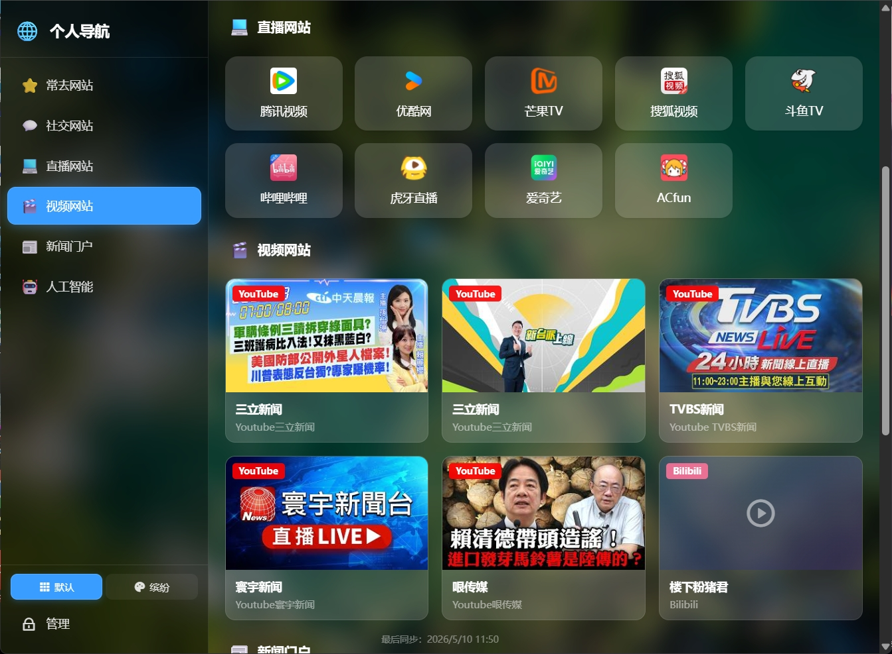
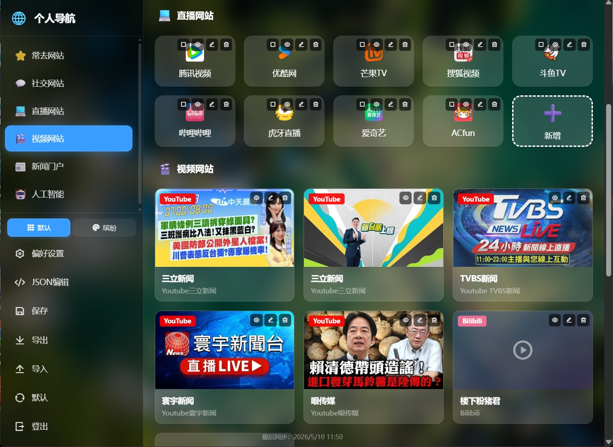
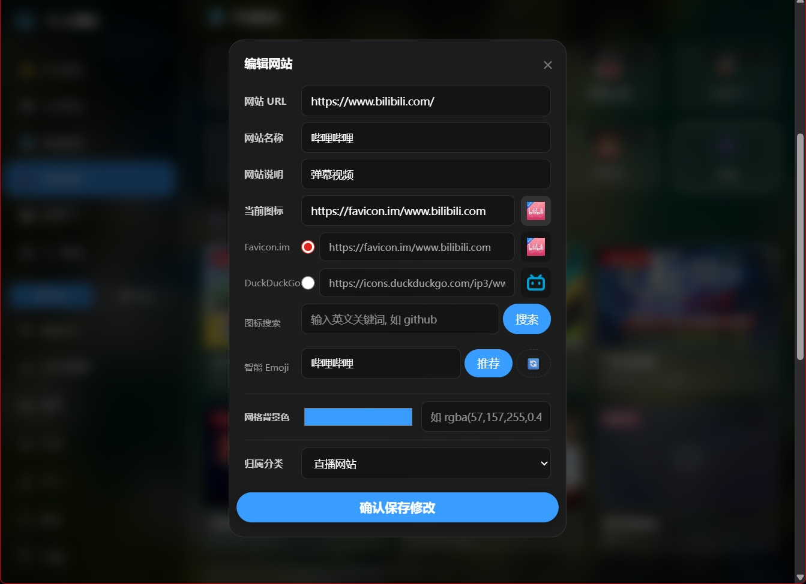
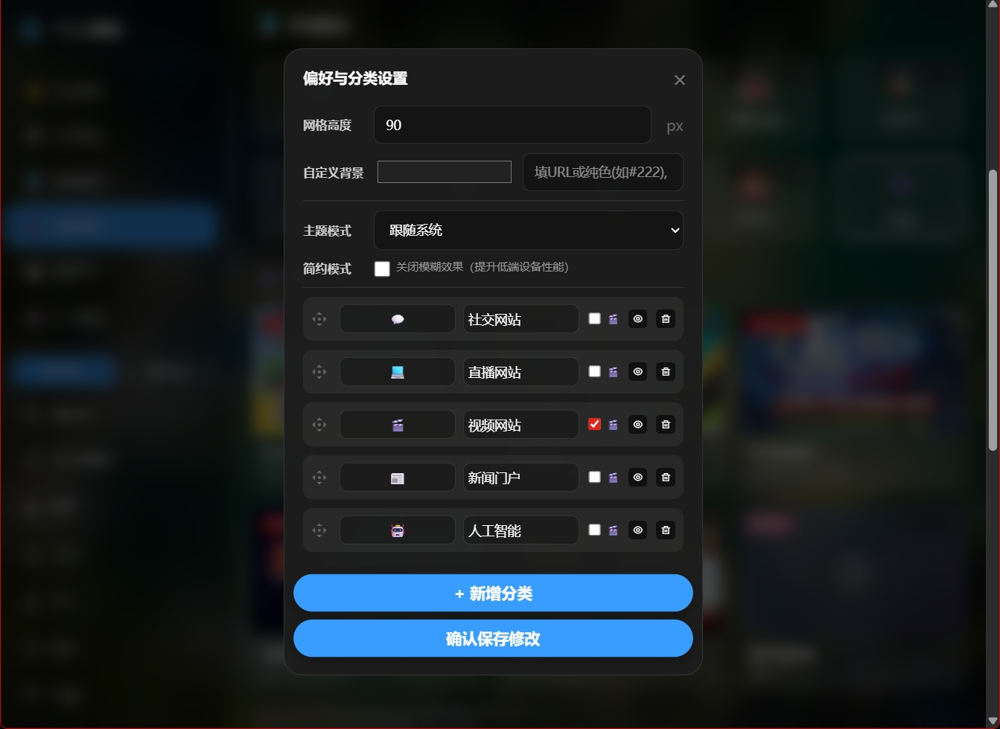

# 🧭 CloudNav - 极简高效的个人网站导航

<div align="center">


**基于 Cloudflare Pages 和 Workers KV 构建的纯云端、无服务器个人导航页。**<br>
零代码基础，全程使用 Google Gemini 问答和生成代码，采用响应式毛玻璃（Glassmorphism）卡片设计，原生 JavaScript 开发，0 成本 5 分钟极速部署。

[👉 在线预览 Demo ，登录后台密码 123456  👈](https://cloudflare-nav-demo.pages.dev)

</div>

## 📸 界面预览

<table style="width: 100%; border-collapse: collapse; border: none;">
  <tr style="border: none;">
    <td align="center" style="border: none; width: 50%;">
      
      <br>
      <sub><b>✨ 首页页面预览</b></sub>
    </td>
    <td align="center" style="border: none; width: 50%;">
      
      <br>
      <sub><b>⚙️ 后台管理页面预览</b></sub>
    </td>
  </tr>
  <tr style="border: none;">
    <td align="center" style="border: none; width: 50%;">
      
      <br>
      <sub><b>➕ 网址条目新增页面预览</b></sub>
    </td>
    <td align="center" style="border: none; width: 50%;">
      
      <br>
      <sub><b>📁 分类管理页面预览</b></sub>
    </td>
  </tr>
</table>

---

## ✨ 核心特性

### 🚀 极速轻量
- 纯原生 HTML/CSS/JS 开发，无冗余前端框架
- 无需 Webpack/Vue/React 构建，直接部署源文件
- 丝滑流畅的交互体验，首屏加载快

### 🎨 现代 UI 设计
- 采用高级毛玻璃（Glassmorphism）视觉效果
- 半透明卡片背景 + 模糊滤镜，视觉层次分明
- **左侧导航栏** + 连续滚动主内容区，导航体验更流畅
- 6 列网格布局（自适应 5/4/3 列响应式断点）
- 悬停上浮动画，交互反馈细腻
- 支持**亮色/暗色主题**自动切换和手动切换
- 支持简约模式（关闭毛玻璃效果，提升低端设备性能）

### 🖼️ 双模式视图
- **默认模式（Style 0）**：经典图标网格，紧凑高效
- **缤纷模式（Style 2）**：列表详情 + 用户自定义背景色，信息更丰富
- 侧边栏底部一键切换视图风格

### 🛠️ 纯云端无服务器
- 完美接入 Cloudflare Pages + KV 数据库
- **零服务器成本**，免去繁琐运维
- 全球 CDN 加速，访问速度有保障
- Serverless 架构，按需自动伸缩

### 🖼️ 动态每日壁纸
- 自动拉取 Bing 每日高清壁纸
- 搭配半透明暗色遮罩，确保文字清晰可读
- 12 小时缓存机制，减少重复请求
- 支持自定义背景图片 URL 或纯色背景

### 📱 完美响应式与 PWA
- 自动适配 PC 端与移动端屏幕
- 移动端侧边栏变为滑出式抽屉，点击汉堡菜单打开
- 支持 PWA 离线缓存，可像原生 App 一样添加到桌面
- 断网也能正常访问已缓存的页面

### 🔐 安全内置后台
- 安全 Token 鉴权（SHA-256 哈希存储，密码不泄露）
- 支持在线可视化增删改查分类与书签
- 支持鼠标/手指**拖拽排序**（网站卡片 + 视频卡片均支持）
- 敏感数据（隐藏的分类/书签）对普通游客不可见
- 支持**批量选择**与批量删除/移动操作

### 🎬 视频导航
- 自动识别 **Bilibili** 和 **YouTube** 视频链接
- 视频分类以大卡片网格展示，含封面图、平台标识
- 点击视频卡片弹出内嵌播放器，无需跳转页面
- 视频弹窗**仅关闭按钮可退出**，避免误触关闭
- 管理员模式下视频卡片支持**拖拽排序**
- 封面加载失败自动降级为图标占位

### 💻 JSON 数据编辑器
- 内置 **Monaco Editor**（VS Code 同款编辑器）
- 可直接在线编辑原始 JSON 数据，适合高级用户批量修改
- 支持一键格式化、保存

### 🤖 智能图标获取
- 内置 Favicon.im 和 DuckDuckGo 接口
- 填入网址自动智能抓取网站图标
- 支持 Iconify 图标库搜索
- 支持 Emoji 图标作为备选
- 图标加载失败时自动回退到随机 Emoji

### 📊 智能"常去"分类
- 自动记录每个书签的点击次数
- 根据访问频次智能生成"常去网站"分类
- 默认展示你最常访问的 Top 12 网站

### 💾 数据安全与便携
- 支持一键**导出配置**（JSON 格式）
- 支持从文件**导入配置**
- 支持一键**恢复默认**配置

---

## 💻 技术栈

| 层级 | 技术 |
|------|------|
| **前端视图** | HTML5, CSS3, ES6 Vanilla JavaScript |
| **后端 API** | Cloudflare Pages Functions (`functions/api/config.js`) |
| **数据存储** | Cloudflare Workers KV |
| **静态资源** | Cloudflare Pages (全球 CDN) |
| **第三方库** | [SortableJS](https://github.com/SortableJS/Sortable) - 拖拽排序 |
| **第三方库** | [RemixIcon](https://remixicon.com/) - 开源精美字体图标 |
| **第三方库** | [Iconify](https://iconify.design/) - 图标搜索服务 |
| **第三方库** | [Monaco Editor](https://microsoft.github.io/monaco-editor/) - 在线代码编辑器 |

---

## 📂 目录结构

```text
cloudflare-nav/
├── public/                           # 静态前端资源 (Pages 部署的根目录)
│   ├── assets/                       # 辅助资源
│   │   ├── css/
│   │   │   └── style.css             # 核心样式（设计系统 + 响应式 + 主题）
│   │   ├── js/
│   │   │   ├── app.js                # 核心前端逻辑（导航渲染、管理、视频、Monaco）
│   │   │   ├── utils.js              # 通用工具函数 (escapeHTML, debounce, emoji)
│   │   │   ├── emoji-pool.js         # Emoji 资源池
│   │   │   └── colorExtractor.js     # 颜色提取工具（缤纷模式）
│   │   └── img/                      # 项目预览图或 UI 图片
│   │       └── preview/              # 项目预览截图
│   ├── index.html                    # 纯净的 HTML 入口
│   ├── manifest.json                 # PWA 配置文件
│   └── ServiceWorker.js              # PWA 核心脚本 (缓存策略)
├── functions/                        # 后端 Serverless API
│   └── api/
│       ├── config.js                 # API 处理逻辑 (GET/POST/DELETE)
│       └── defaultData.js            # 默认初始化数据
├── .gitattributes                    # Git 属性配置
└── README.md                         # 项目文档
```

---

## 🎨 设计系统

### 布局架构
- **左侧导航栏**（250px 宽度）：分类导航 + 风格切换 + 管理操作
- **主内容区**：连续滚动的分类区块，最大宽度 62rem (992px)
- **卡片网格**：6 列 → 5 列 → 4 列 → 3 列，响应式断点分别为 1200px / 900px / 600px

### 主题系统
| 主题 | 说明 |
|------|------|
| 暗色主题 | 默认深色毛玻璃风格 |
| 亮色主题 | 温和柔光风格，柔和不刺眼 |
| 跟随系统 | 根据 OS 偏好自动切换亮暗 |
| 简约模式 | 关闭 backdrop-filter 毛玻璃效果 |

### 视图模式
| 模式 | 说明 |
|------|------|
| 默认模式（Style 0） | 经典图标 + 文字卡片网格 |
| 缤纷模式（Style 2） | 横排列表卡片，支持自定义背景色 |

---

## 🚀 部署指南 (Cloudflare Pages)

**完全免费，整个部署过程不超过 10 分钟！**

### 准备工作

1. **注册 Cloudflare 账号**：访问 [dash.cloudflare.com](https://dash.cloudflare.com/) 注册
2. **准备 GitHub 仓库**：将项目代码上传到你的 GitHub 仓库

### 第一步：上传到 GitHub

1. 登录 GitHub，新建一个仓库（例如 `my-nav`）
2. 将本地 `cloudflare-nav` 文件夹内容上传到该仓库
3. 或者直接 Fork 本项目到你的 GitHub 账户

### 第二步：创建 Cloudflare 项目

1. 登录 [Cloudflare 控制台](https://dash.cloudflare.com/)
2. 在左侧菜单找到 **Workers & Pages** → 点击 **创建应用程序 (Create application)**
3. 切换到 **Pages** 标签页 → 点击 **连接到 Git (Connect to Git)**
4. 授权 GitHub 并选择你刚刚准备好的仓库
5. **构建设置 (Build Settings)**：
   - 框架预设 (Framework preset): `None`（重要！）
   - 构建命令 (Build command): *(留空)*
   - 构建输出目录 (Build output directory): `public`
6. 点击 **保存并部署 (Save and Deploy)** 按钮

### 第三步：配置 KV 数据库

> 这是数据存储的核心，必须配置！

1. 回到 Cloudflare 控制台，进入左侧 **Workers & Pages** → **KV**
2. 点击 **创建命名空间 (Create a namespace)**
3. 输入名字（例如 `my_nav_db`），点击确认创建
4. **注意**：记下这个 KV 名字，后面会用到

### 第四步：绑定 KV 到 Pages 项目

1. 进入你刚才部署好的 Pages 项目详情页
2. 点击 **设置 (Settings)** 选项卡
3. 找到 **Functions** → **KV 命名空间绑定 (KV namespace bindings)**
4. 点击 **绑定变量 (Bind variable)**：
   - **变量名称 (Variable name)**：必须填入 `nav`（这是代码中硬编码的变量名）
   - **KV 命名空间**：选择你刚才创建的数据库（如 `my_nav_db`）
5. 点击 **保存 (Save)** 按钮

### 第五步：设置管理员密码

> 这是一个重要的安全步骤，用于保护你的后台管理功能

1. 在项目设置页面，找到 **环境变量 (Environment variables)**（在 Functions 下方）
2. 点击 **添加变量 (Add variable)**：
   - **变量名称**：必须填入 `TOKEN`（这是代码中硬编码的变量名）
   - **值 (Value)**：填入你想要的后台登录密码（例如 `mypassword123`）
3. ⚠️ **建议**：点击右侧的 `加密` 按钮将密码加密存储
4. 点击 **保存 (Save)** 按钮

> **注意**：密码建议使用强密码，包含字母、数字、特殊字符，长度不少于 8 位。

### 第六步：重新部署生效

1. 返回到项目的 **部署 (Deployments)** 页面
2. 找到最新的一次部署记录
3. 点击最右侧的三个点 `...` → **重试部署 (Retry deployment)**
4. 等待部署完成后，点击系统分配的域名即可访问！

---

## 🎮 使用说明

### 首次访问

1. 打开 Cloudflare 分配给你的域名
2. 你将看到默认的导航页面，包含预设的分类和书签

### 进入后台管理

1. 点击**左侧导航栏底部**的 **"管理"** 按钮
2. 弹出登录框，输入你在环境变量中设置的 `TOKEN` 密码
3. 点击登录即可进入管理模式

### 管理员功能

| 功能 | 操作说明 |
|------|----------|
| **新增书签** | 在对应分类下点击虚线框的 **"新增"** 卡片 |
| **编辑书签** | 点击书签右上角的 ✏️ 编辑图标 |
| **删除书签** | 点击书签右上角的 🗑️ 删除图标 |
| **隐藏书签** | 点击书签右上角的 👁️ 眼睛图标（隐藏后普通用户看不到） |
| **拖拽排序** | 管理员模式下按住卡片拖动调整顺序（网站卡片 & 视频卡片均支持） |
| **批量操作** | 点击书签右上角的 ☑️ 批量选择按钮，支持批量删除和移动 |
| **播放视频** | 点击视频卡片弹出内嵌播放器（仅关闭按钮可退出弹窗） |
| **切换视图** | 在侧边栏底部点击 **"默认"** / **"缤纷"** 切换风格 |
| **切换主题** | 点击侧边栏管理区域的主题切换按钮（亮色/暗色/跟随系统） |
| **新增分类** | 进入管理模式后，点击 **"偏好设置"** → **"+ 新增分类"** |
| **编辑分类** | 在偏好设置中修改分类名称和图标 |
| **隐藏分类** | 在偏好设置中点击分类右侧的眼睛图标 |
| **删除分类** | 在偏好设置中点击分类右侧的删除图标（会同时删除该分类下所有书签） |
| **调整分类顺序** | 在偏好设置中拖拽分类卡片调整顺序 |
| **设置卡片宽度** | 在偏好设置中调整"网格宽度"数值 |
| **自定义背景** | 在偏好设置中填入图片 URL 或纯色（如 `#222`），留空使用 Bing 壁纸 |
| **JSON 编辑** | 点击 **"JSON编辑"** 使用 Monaco Editor 直接编辑原始数据 |
| **导出配置** | 点击 **"导出"** 按钮下载 JSON 备份文件 |
| **导入配置** | 点击 **"导入"** 按钮从 JSON 文件恢复 |
| **恢复默认** | 点击 **"默认"** 按钮恢复初始配置 |
| **退出管理** | 点击 **"登出"** 按钮退出管理模式 |

### 游客视图 vs 管理员视图

- **普通游客**：只能看到未隐藏的分类和书签
- **管理员**：可以看到所有内容，包括隐藏的分类和书签，并进行编辑操作

### 视频导航说明

当分类被标记为**视频分类**时，该分类下的书签会以视频卡片形式展示：

- **Bilibili 视频**：自动显示封面图、Bilibili 标识，支持内嵌播放
- **YouTube 视频**：自动显示封面图、YouTube 标识，支持内嵌播放
- **其他链接**：以普通卡片展示，点击在新窗口打开
- **弹窗播放**：点击视频卡片弹出播放器，**只能通过右上角关闭按钮退出**
- **拖拽排序**：管理员模式下视频卡片可拖拽调整顺序

---

## ⚙️ 进阶配置

### 绑定自定义域名（可选）

1. 在 Cloudflare 控制台进入你的 Pages 项目
2. 点击 **自定义域 (Custom domains)**
3. 输入你已有的域名，按照提示配置 DNS 记录

### 开启 HTTPS

- Cloudflare Pages 默认自动提供 HTTPS
- 如果绑定自定义域名，确保 Cloudflare 自动签发 SSL 证书

### 性能优化

- Cloudflare 会自动缓存静态资源
- 可以在 Cloudflare 控制台配置页面规则优化缓存策略
- 低端设备可开启**简约模式**，关闭毛玻璃效果提升渲染性能

---

## 📄 开源协议

本项目采用 [MIT License](LICENSE) 开源协议。

---

## 🙏 致谢

- [SortableJS](https://github.com/SortableJS/Sortable) - 拖拽排序功能
- [RemixIcon](https://remixicon.com/) - 精美的图标字体
- [Iconify](https://iconify.design/) - 丰富的图标搜索服务
- [Monaco Editor](https://microsoft.github.io/monaco-editor/) - 在线代码编辑器
- [Favicon.im](https://favicon.im/) - 智能 favicon 获取
- [Bing](https://www.bing.com/) - 每日高清壁纸
